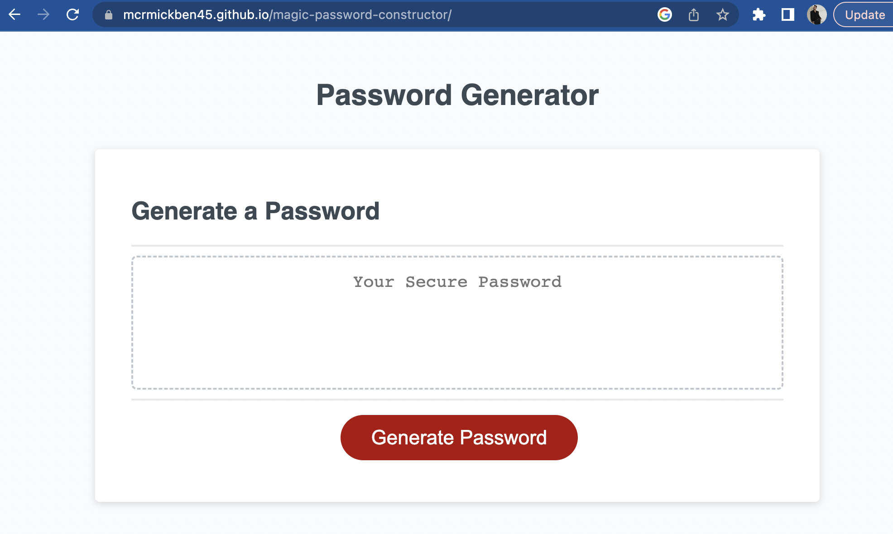

# Magic Password Constructor // Password Generator

Employees with access to sensitive data want to easily generate a strong, secure password fulfilling security criteria using online password generators.

## Table of Contents

- [Introduction](#introduction)
- [Usage](#usage)
- [Configuration](#configuration)
- [Credits](#credits)
- [Website](#website)
- [License](#license)

## Introduction

Password generators can provide more uniquely strong and secure passwords for those accessing secure data. The foundation of the password generator utilizes html as the structure of our password generator, CSS to style the content and cosmetics of the generator, and JavaScript to input the functionality of the website to be able to generate a unique password by gathering inputs through a series of prompts and user provided criteria. User provided criteria inputted into the password generator includes: a length of at least 8 characters and no more than 128 characters, the confirmation of whether or not to include lowercase, uppercase, numeric, and/or special characters, and the input should be validation and the minimum of at least one character type being selected. 

## Usage
1. Open the password generator URL in browser.
2. Generate a random secure password by clicking "Generate Password" and completing the following prompts directed by the gerenator.

## Configuration
Built using:
- HTML
- CSS
- JavaScript

## Credits 

This Password Generator was created by Ben McCormick using the starter code provided by https://github.com/coding-boot-camp/friendly-parakeet

## Website
https://mcrmickben45.github.io/magic-password-constructor/ 

## License